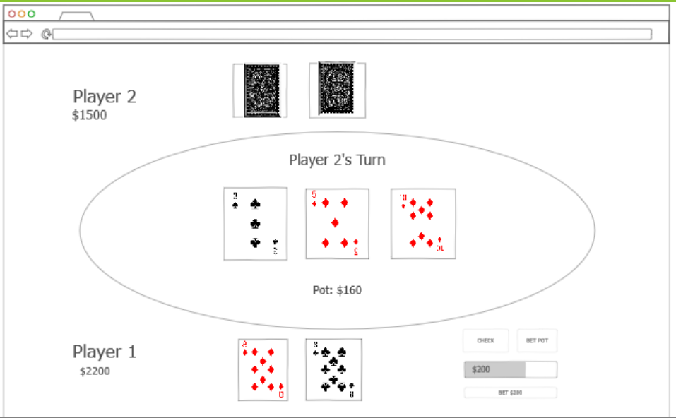

# CoolPoker

Have you ever wanted to play a quick round of poker but didn't want to risk any money? Introducing the CoolPoker app! Here, you can quickly create a game of Heads Up No Limit Texas Hold'em to play with a friend online in real-time. The game settings are fully customizable, so you can play however you like whenever you like.  With the login feature, you can also save previous games and settings, so you can easily pick up where you left off!



Key features

- Logging in and registering over HTTPS
- Game creation page to create a new game with a variety of settings
- Game states are saved persistently
- Game actions are displayed to the other player in real time
- Games can be saved to be played at a later date
- Previous games can be accessed through the user profile page
- User profile page has various statistics, such as games played and money won
- Games can be shared with a URL


## Startup JS - Notes

I used a lot of localStorage as a substitute for server use, since just pure JS on the client side doesn't really lend itself to online multiplayer all that well. That being said, I still learned a lot about adding and changing state to web pages. For instance, you can change the page URI with something like 

```javascript
history.replaceState(null, null, '/game.html');
```

You do have to make sure that elements refresh correctly but that's basically all you need!

I also learned a lot more about Javascript's JSON tie-ins. It's fairly easy to put JSON in the url by doing:

```javascript
let encodedurl = encodeURI(JSON.stringify(gameArray));
```

I'm sure there are ways to pass data through the form or other POST somethings, but for now URL data works great. And besides, one of my objectives was to be able to share a game just with a URL so it works out.

## Simon JS - Notes

I think the coolest thing I learned was just how useful local storage can be. For example, loading a value into storage is as easy as
```javascript
localStorage.setItem("userName", nameEl.value);
```
And extrating that value is just
```javascript
return localStorage.getItem('userName');
```
It does make me wonder what the limit for storage is, if it's browser enforced or just however much storage the user has.

I also learned that different browsers have different default permissions - for instance, Safari apparently requires permission to play sound. 


## Startup HTML/CSS - Notes

I learned that the vast majority of what I would have put in a css file can simply be offloaded to Boostrap. I don't know if this was good practice or not, but it was a good test of my skills with a new framework regardless. 

I also learned the concept of 12 columns per row. This can be gotten around, but in general splitting up a row into 12 allows flexibility in terms of how much space you give one column vs the other.

I think the most important thing I learned was how to navigate the Bootstrap documentation. It is surprisingly readable, and I enjoyed looking at all the examples they provided.

## Simon CSS - Notes

Something that I learned was that there is a sort of mindset as to how to use bootstrap. Instead of having to code everything and finagling everything into its own place, with Bootstrap you can just type what you would like it to be and (for the most part) it just does it. Some useful classes I've found are:

- bg-dark: useful for a darker color scheme which I prefer
- container-fluid: good for mentally arranging elements
- text-reset: I didn't even know this was an option until this project, but it's very useful for changing the color of links
- bg-secondary: having everything the same color is a bit boring, so having a secondary theme color spices things up a bit.


## Simon HTML - Notes

I am once again impressed by how easiy it is to put files with a Caddy backend and have it deploy. Something I didn't notice before was that there is a specific element for superscript text, the \<sup\> tag. I also learned that you can put SVG's in buttons, which in retrospect makes sense since I knew that sputting regular images in a button was possible. Finally, I learned that you can put foreign characters directly into the HTML document without it breaking.

Notes for future me:
- IP address is http://18.216.28.197/
- remember to shut down both the instance AND the elastic IP address (they are separate)


## Class notes

Some CSS notes:

- em is multiples of the width of the letter m in the parent's font
- rem is the same, but for the root font
- you can put self-hosted fonts directly in css with @font-face, or impor tthem with @import url().

### Display options:
- none - not visibile
- block - parent width
- inline - content width
- flex - display children flexibly
	- display: flex;
	- flex-direction: row;
	- Then in children, put
	- `flex: 0 80px`
		- 0/1 means will grow/not grow, 80px is the starting growth. If put 1, gets 1fr.
- grid - display children in grid
	- display: grid;
	- grid-template-columns: 1fr 1fr;
- alternative grid:
	- grid-template-columns: repeat(auto-fill, minmax(300px, 1fr));
		- make children 300 px minimum width, 1 fr(actional unit) max
	- grid-auto-rows: 300px;
	- grid-gap: 1em;