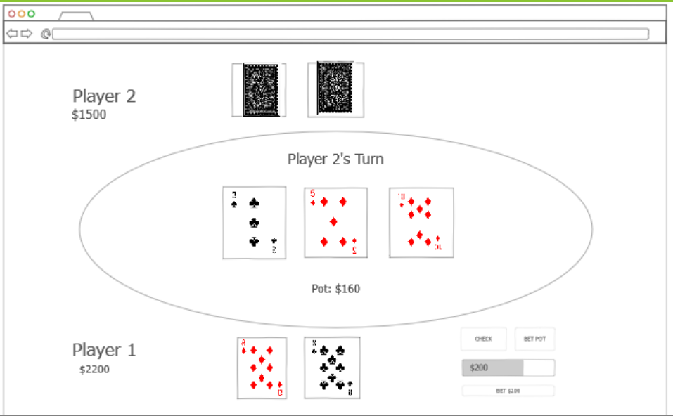

# CoolPoker

Have you ever wanted to play a quick round of poker but didn't want to risk any money? Introducing the CoolPoker app! Here, you can quickly create a game of Heads Up No Limit Texas Hold'em to play with a friend online in real-time. The game settings are fully customizable, so you can play however you like whenever you like.  With the login feature, you can also save previous games and settings, so you can easily pick up where you left off!



Key features

- Logging in and registering over HTTPS
- Game creation page to create a new game with a variety of settings
- Game states are saved persistently
- Game actions are displayed to the other player in real time
- Games can be saved to be played at a later date
- Previous games can be accessed through the user profile page
- User profile page has various statistics, such as games played and money won
- Games can be shared with a URL

## Startup React - Notes

For some reason it didn't fully click until now how the transition to production works:

- For development, all requests have to go through the React dev server on port 3001. It then passes any unknown requests (including API calls) to the express server running on port 3000 by that proxy line. 

- For production, all requests have to go through the express server. The express server then uses its routing capabilities to serve both api and regular get requests to the webpages. Those webpages then call fetch("/api/whatever"), and that is automatically the domain name!

## Simon React - Notes

I think the primary thing I learned was that transitioning an app from just regular html/css/js to react is on par with just building it again from scratch with React in mind. I'd say its similar to test-driven development: if you don't have it in mind when you're writing it, then it's much harder to force it later on. 

I also like the modular design of having an essentially completely separate app for the api calls, and the react app. It's essentially the same as having a 3rd party API, just without having to worry about CORS.

I learned more about environment variables and how to use them. I didn't know it was possible to have them be programmatically updated under the hood. Knowing that, adding differences between development and production is as simple as

```javascript
let port = window.location.port;
if (process.env.NODE_ENV !== 'production') {
  port = 3000;
}
```


## Startup Service - Notes

what you have learned using services, node.js, mongodb, authentication, and webSockets:
This has been quite the enlightening experience for me, developing this app. It's still not nearly as polished as I'd like - the actual game code is quite finicky - but I very much enjoyed working on it so far. Some important things I've learned:

- Make sure to have all the dependencies in the package.json file. For some reason Express wasn't there originally, so I had some issues getting the app to work in the production environment.

- You can do middleware for routers. For example, I had wanted to make sure the user was logged in before accessing certain pages, such as the profile page. Otherwise, I would like it to redirect. This was accomplished with

```javascript
const loggedInMiddleware = async (req, res, next) => {
    if (req.cookies.userToken) {
        const user = await DB.getUserByToken(req.cookies.userToken);
        if (user) {
            console.log("got user...");
            res.status(422).send({msg: 'need to redirect to profile'});
            return;
        } else {
            console.log("no matching user found");
        }
    }
    next();
}
...
apiRouter.get('/', loggedInMiddleware, (req, res) => {
    res.send('welcome to a simple HTTP cookie server');
});
```

- When developing the WebSocket part of the app, I realized that the websocket connection is just a socket connection - obvious in hindsight, I know. I learned a bit about sockets in my systems programming class, and so making the connection made thigns a bit clearer. I imagine it as, the server checks the socket "mailbox" for any messages, and can send messages back.

- For fetch requests, it's a lot simpler just to just include the relative path instead of the full startup.coolpoker.click bit. It makes transitioning from development to production a lot easier:

```javascript
const response = await fetch(`/api/user/${email}`);
  if (response.status === 200) {
    return response.json();
  }
```

- I learned I really like MongoDB, since it's much easier to quickly iterate and change things as opposed to a regular SQL database. Instead of having to UPDATE with a new column every time I realized I needed a new attribute, I just added it to the request and MongoDB handles it like a champ! One issue I did face was MongoDB acting weird when accessing a collection that didn't exist, but that's understandable.

- I had watched a video on test driven development that mentioned I should try and put as much logic server-side as I can. While I didn't follow TDD for this project, putting logic for everything from authentication to finding which actions are valid on the server made it easier to debug and find problems.

## Simon Websocket - Notes

I had never really looked at what Websocket actually was, and so it seemed pretty cool after looking at the class's articles. I had always thought that sending full-fledged HTTP requests either way was the only real way to communicate, so finding out there were alternatives was fun. It is, in my mind, a very similar setup to a normal express server, except you do it for both the client code and the server code. That is, you tell it "when you get this message, do this thing." For example, this is for when the connection is opened:

```javascript
this.socket.onopen = (event) => {
      this.displayMsg('system', 'game', 'connected');
    };
```

For when it's closed:

```javascript
this.socket.onclose = (event) => {
      this.displayMsg('system', 'game', 'disconnected');
    };
```

And for when there's a brand new message that came in:

```javascript
    this.socket.onmessage = async (event) => {
      const msg = JSON.parse(await event.data.text());
      if (msg.type === GameEndEvent) {
        this.displayMsg('player', msg.from, `scored ${msg.value.score}`);
      } else if (msg.type === GameStartEvent) {
        this.displayMsg('player', msg.from, `started a new game`);
      }
    };
```

## Simon login - Notes

So it turns out I forgot to restart the simon service, meaning it was still referencing the old service's connection details. I restarted it with

```bash
pm2 restart all --update-env
pm2 save
```

Not too bad, just gave me an hour or so of head scratching.

I learned a lot about authorization in relation to web servies. Maybe the most interesting thing was how passwords are verified after being passed through a hash function. It's just comparing the two using bcrypt:

```javascript
app.post('/auth/login', async (req, res) => {
  const user = await getUser(req.body.email);
  if (user) {
    if (await bcrypt.compare(req.body.password, user.password)) {
      setAuthCookie(res, user.token);
      res.send({ id: user._id });
      return;
    }
  }
  res.status(401).send({ msg: 'Unauthorized' });
});
```

Where it follows the sequence of:
1. Query the database to find a document/BSON object with a matching email field
2. If we found one, compare the password from the request to the one in the database. If they match, send an authorization cookie.
3. Otherwise, say you're unauthorized.

I know there's a lot more in regards to securing web applications, but this seems like a fairly straighforward first step. I know that salting is a thing, so maybe in the future I can implement that in some of my personal projects.

## Simon DB - Notes

I have the advantage of taking this class at the same time as CS452, which covers databases. It so happens that we're covering MongoDB now as well, which is helpful. This class was helpful in the best practices surrounded databases, such as storing usernames and keys not in the public github repo. For production/linux environments, you just modify

```
/etc/environment
```

That is, the file environment (no file extension) in the etc/ folder. There, you just add the lines KEYNAME=keyvalue

For Windows, it's the same sort of action of editing the PATH variable, except you get to add your own variables this time! I've actually never done that before and thought that was cool.

This project also helped me understand what a cursor is - basically, just a pointer to the first item in the list. you can call the forEach() function on it to iterate through it, similar to a regular iterator. 

## Simon Service - Notes

The straightforwardness of middleware was even more evident after making the Simon application with it. It really is as simple as telling express what you want to have happen. For example,

Telling express "I'd like to parse body requests with JSON":
```javascript
app.use(express.json());
```

Telling express "I'd like to serve static files from the public directory":
```javascript
app.use(express.static('public'));
```

Telling express "I'd like to pass the handling of all /api requests to a router":
```javascript
var apiRouter = express.Router();
app.use(`/api`, apiRouter);
```

Telling a router "When you get a post request to /score, I'd like you to do this":
```javascript
apiRouter.post('/score', (req, res) => {
  scores = updateScores(req.body, scores);
  res.send(scores);
});
```

It's a different mentality than a lot of other programming I've done but I do like it a lot.

## Fetch - Notes

For a simple GET request, using fetch is as simple as:

```javascript
fetch('https://api.quotable.io/random')
  .then((response) => response.json())
  .then((jsonResponse) => {
    console.log(jsonResponse);
  });
```

For POST it's a bit more complicated, but fairly straightforward JSON syntax:

```javascript
fetch('https://jsonplaceholder.typicode.com/posts', {
  method: 'POST',
  body: JSON.stringify({
    title: 'test title',
    body: 'test body',
    userId: 1,
  }),
  headers: {
    'Content-type': 'application/json; charset=UTF-8',
  },
})
  .then((response) => response.json())
  .then((jsonResponse) => {
    console.log(jsonResponse);
  });
```

This code came from [here](https://github.com/webprogramming260/.github/blob/main/profile/webServices/fetch/fetch.md).

## Startup JS - Notes

I used a lot of localStorage as a substitute for server use, since just pure JS on the client side doesn't really lend itself to online multiplayer all that well. That being said, I still learned a lot about adding and changing state to web pages. For instance, you can change the page URI with something like 

```javascript
history.replaceState(null, null, '/game.html');
```

You do have to make sure that elements refresh correctly but that's basically all you need!

I also learned a lot more about Javascript's JSON tie-ins. It's fairly easy to put JSON in the url by doing:

```javascript
let encodedurl = encodeURI(JSON.stringify(gameArray));
```

I'm sure there are ways to pass data through the form or other POST somethings, but for now URL data works great. And besides, one of my objectives was to be able to share a game just with a URL so it works out.

## Simon JS - Notes

I think the coolest thing I learned was just how useful local storage can be. For example, loading a value into storage is as easy as
```javascript
localStorage.setItem("userName", nameEl.value);
```
And extrating that value is just
```javascript
return localStorage.getItem('userName');
```
It does make me wonder what the limit for storage is, if it's browser enforced or just however much storage the user has.

I also learned that different browsers have different default permissions - for instance, Safari apparently requires permission to play sound. 


## Startup HTML/CSS - Notes

I learned that the vast majority of what I would have put in a css file can simply be offloaded to Boostrap. I don't know if this was good practice or not, but it was a good test of my skills with a new framework regardless. 

I also learned the concept of 12 columns per row. This can be gotten around, but in general splitting up a row into 12 allows flexibility in terms of how much space you give one column vs the other.

I think the most important thing I learned was how to navigate the Bootstrap documentation. It is surprisingly readable, and I enjoyed looking at all the examples they provided.

## Simon CSS - Notes

Something that I learned was that there is a sort of mindset as to how to use bootstrap. Instead of having to code everything and finagling everything into its own place, with Bootstrap you can just type what you would like it to be and (for the most part) it just does it. Some useful classes I've found are:

- bg-dark: useful for a darker color scheme which I prefer
- container-fluid: good for mentally arranging elements
- text-reset: I didn't even know this was an option until this project, but it's very useful for changing the color of links
- bg-secondary: having everything the same color is a bit boring, so having a secondary theme color spices things up a bit.


## Simon HTML - Notes

I am once again impressed by how easiy it is to put files with a Caddy backend and have it deploy. Something I didn't notice before was that there is a specific element for superscript text, the \<sup\> tag. I also learned that you can put SVG's in buttons, which in retrospect makes sense since I knew that sputting regular images in a button was possible. Finally, I learned that you can put foreign characters directly into the HTML document without it breaking.

Notes for future me:
- IP address is http://18.216.28.197/
- remember to shut down both the instance AND the elastic IP address (they are separate)


## Class notes

Some CSS notes:

- em is multiples of the width of the letter m in the parent's font
- rem is the same, but for the root font
- you can put self-hosted fonts directly in css with @font-face, or impor tthem with @import url().

### Display options:
- none - not visibile
- block - parent width
- inline - content width
- flex - display children flexibly
	- display: flex;
	- flex-direction: row;
	- Then in children, put
	- `flex: 0 80px`
		- 0/1 means will grow/not grow, 80px is the starting growth. If put 1, gets 1fr.
- grid - display children in grid
	- display: grid;
	- grid-template-columns: 1fr 1fr;
- alternative grid:
	- grid-template-columns: repeat(auto-fill, minmax(300px, 1fr));
		- make children 300 px minimum width, 1 fr(actional unit) max
	- grid-auto-rows: 300px;
	- grid-gap: 1em;